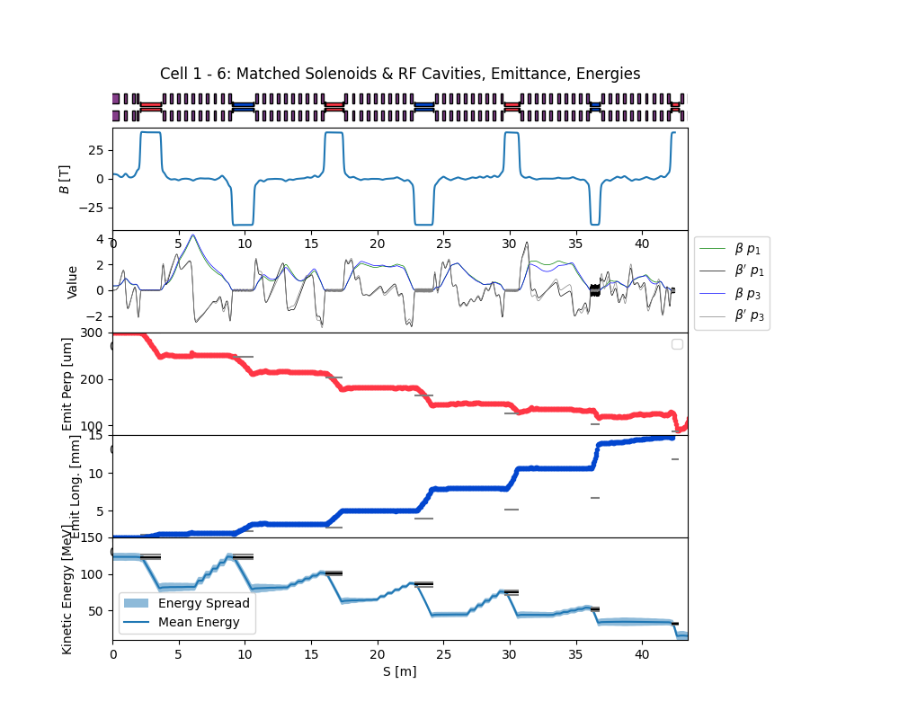

# Final Cooling Lattice
R. Taylor

Performance Table

|   Cell No |   Z End [m] |   εT [μm] |   εL [mm] |   KE [MeV] |   σKE [MeV] |   Transm [%] |
|----------:|------------:|----------:|----------:|-----------:|------------:|-------------:|
|         0 |         3.6 |     236.4 |       1.8 |       80.8 |         6.7 |        100   |
|         1 |        10.6 |     205.5 |       2.7 |       80.1 |         4.7 |         99.8 |
|         2 |        17.3 |     175.9 |       3.6 |       65.7 |         3.9 |         99.7 |
|         3 |        24.1 |     139.1 |       5.3 |       45.9 |         4.7 |         99.6 |
|         4 |        30.6 |     116   |       7.1 |       43.1 |         4.6 |         99.2 |
|         5 |        36.7 |     109.1 |       9.6 |       34.2 |         3.2 |         99   |
|         6 |        42.6 |      72.3 |      18   |       14.5 |         3.9 |         98.1 |
|         7 |        48.4 |      59.2 |      27.7 |       11.3 |         3.9 |         96.8 |
|         8 |        54.2 |      48.5 |      44.7 |       12.4 |         4.3 |         96.7 |
|         9 |        60   |      33.1 |      68.5 |        7.8 |         4.1 |         75   |
